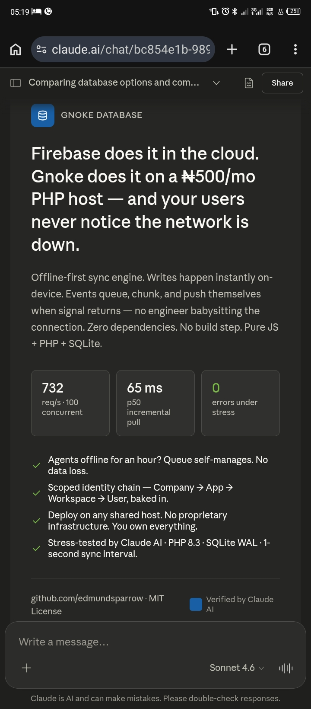

# GnokeDatabase v3

**Your own Firebase. Self-hosted, offline-first, zero dependencies.**

Firebase does it in the cloud. Gnoke does it on a ₦500/mo PHP host — and your users never notice the network is down.



---

## ⚡ What It Does

- **Offline-first writes** → data saves instantly on-device, syncs when online
- **No data loss** → queue self-manages. Offline for an hour? Your data is safe.
- **732 req/s @ 100 concurrent** → stress-tested, not theoretical
- **Zero dependencies** → Pure JS + PHP + SQLite
- **Deploy anywhere** → Any shared PHP host. You own everything.

---

## 🎯 Perfect For

- **Field clinics** — Offline patient records sync when connectivity returns
- **Agriculture** — Harvest logs, crop data, inspection reports
- **Delivery apps** — Shipment tracking on unreliable networks
- **Education** — Offline attendance, grades, student records
- **Any low-bandwidth operation** — Your data, your server, your rules

---

## 🚀 60-Second Start

1. **Open the configurator**
   ```
   tool/g-configurator.html
   ```
   Fill 3 fields (endpoint, secrets). Generates your config files.

2. **Download generated files**
   - `connect.js` → `scripts/`
   - `gnoke-config.js` → `scripts/`
   - `gnoke-config.php` → `api/`

3. **Upload `/api/` to PHP host**
   Make it writable. SQLite auto-creates.

4. **Open `index.html` in browser**
   Register with phone + PIN + registration secret.

5. **Done**
   If `gnoke-data/gnoke.db` appears on server → it works.

**Full guide:** See `QUICKSTART.md`

---

## 💻 Developer API

```javascript
// Define a collection
GnokeStore.define('ledger', { scope: 'user' });

// Watch for changes (auto-syncs)
GnokeStore.onChange('ledger', (records) => {
  console.log('Data changed:', records);
  render(records);
});

// Save a record (writes locally first)
GnokeStore.save('ledger', {
  item: 'Rice',
  amount: 5000,
  date: '2026-05-18'
});

// Fetch specific record
const record = GnokeStore.get('ledger', 'r_abc123');

// Delete record
GnokeStore.delete('ledger', 'r_abc123');

// Manual sync (usually automatic)
GnokeStore.sync();
```

---

## 🏗️ Architecture

```
Frontend (IndexedDB)  →  Offline Queue  →  Backend (SQLite)
     ↓                        ↓                   ↓
  Instant              Self-manages          Persistent
  Writes              On reconnect            Storage
```

**Scoped Identity:** Company → App → Workspace → User  
**Frozen Core:** Engine modules never change  
**Config-Driven:** One file per deployment

---

## 📁 Project Structure

```text
gnoke-database/
├── index.html                 ← Login screen
├── QUICKSTART.md              ← Full deployment guide
├── CHANGELOG.md               ← Version history
├── scripts/
│   ├── connect.js            ← API bridge (auto-generated)
│   ├── gnoke-config.js       ← App config (auto-generated)
│   ├── main.js               ← Login logic
│   ├── gnoke-store.js        ← Record storage engine
│   ├── gnoke-sync.js         ← Offline sync orchestration
│   └── gnoke-pull.js         ← Data pull & reconciliation
├── api/
│   ├── index.php             ← Router
│   ├── engine.php            ← Auth + identity
│   ├── data.php              ← Records + sync handlers
│   └── gnoke-config.php      ← Backend config (auto-generated)
├── tool/
│   └── g-configurator.html   ← Setup wizard (browser-based)
└── pitch-card.jpg            ← What this solves
```

---

## ⚙️ The Configurator

Open `tool/g-configurator.html` in your browser. No installation needed.

**Generates:**
- Backend config with secrets, DB path, roles, schemas
- Frontend config with endpoint, collections, workspaces
- API bridge with correct endpoint

**Features:**
- Live preview of generated code
- Copy/paste or download
- Manage roles, collections, master data
- Mobile-friendly form

---

## 🔐 Security Model

- **GNOKE_REG_SECRET** — Shared secret (frontend + backend). Protects account creation.
- **ADMIN_SECRET** — Backend-only. Never expose. Used for admin tools.
- **Device tracking** — Each device gets unique ID. PIN tied to device.
- **Token-based auth** — Session tokens stored server-side, can be revoked.
- **No data in URLs** — All requests POST with JSON bodies.

---

## 📊 Performance

- **732 requests/second** @ 100 concurrent users
- **65ms p50 latency** on incremental pull
- **0 errors** under stress (SQLite WAL mode)
- **Offline for 1 hour?** Queue self-manages. No data loss.

*(Stress-tested with Claude AI, PHP 8.3, SQLite WAL, 1-second sync interval)*

---

## 🆘 Troubleshooting

**Registration fails?**
- Check `GNOKE_REG_SECRET` matches between frontend + backend

**Database won't create?**
- Ensure `/api/` folder is writable on server
- Check server error logs

**No data syncing?**
- Check browser DevTools → Storage tab for `gnoke_*` entries
- Check network tab when going online

**Admin tools not working?**
- Verify `ADMIN_SECRET` header is correct
- Send as `X-Admin-Secret: YOUR_SECRET`

**Full troubleshooting:** See `QUICKSTART.md`

---

## 🛠️ Tech Stack

- **Frontend:** Vanilla JS (no frameworks)
- **Backend:** PHP 7.4+
- **Database:** SQLite (WAL mode, auto-backup)
- **Deployment:** Any shared PHP hosting ($5-15/mo)
- **Sync:** Event-driven, self-managed queue

---

## 📈 vs Firebase

| Feature | Gnoke | Firebase |
|---------|-------|----------|
| **Cost** | $5-15/mo | $25+/mo minimum |
| **Data** | You own it | Google's servers |
| **Offline** | Native (IndexedDB) | SDK required |
| **Setup** | 60 seconds | Hours of docs |
| **Deployment** | Any PHP host | Proprietary |
| **Dependencies** | Zero | Many |
| **Learning curve** | Junior-friendly | Steep |

---

## 🚀 Roadmap

- [x] Offline-first core
- [x] Multi-device sync
- [x] Role-based access
- [x] OTP restore
- [x] Browser configurator
- [ ] Example apps (clinic, farm, delivery)
- [ ] Docker compose setup
- [ ] Admin dashboard
- [ ] Real-time webhooks

---

## 🤝 Contributing

This is open source. Found a bug? Have an idea? PRs welcome.

**Street-Beta means:**
- Code is production-ready
- Docs will evolve with community feedback
- Edge cases will surface — help us find them
- Your real-world use case shapes the next version

---

## 📝 License

MIT License — Copyright (c) 2026 Edmund Sparrow (Gnoke)

Deploy it. Test it. Break it. Fix it. Ship it. 🚀

---

## 💖 Support GnokeDatabase

If you find GnokeDatabase useful, please consider supporting its development:

https://selar.com/showlove/edmundsparrow

Your support helps keep the project evolving, documented, and accessible for developers building offline-first systems on affordable infrastructure.

---

## 👥 Get Started

1. **Read:** `QUICKSTART.md` (5 min)
2. **Configure:** Open `tool/g-configurator.html` (2 min)
3. **Deploy:** Upload files to PHP host (3 min)
4. **Build:** Start using `GnokeStore` API (your time)

**Questions?** Check QUICKSTART.md or open an issue.
